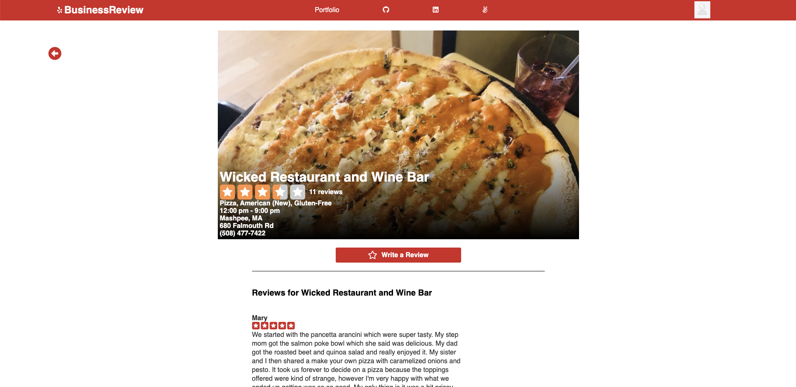
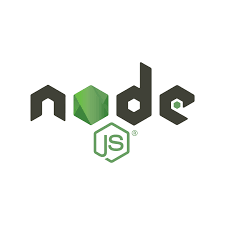
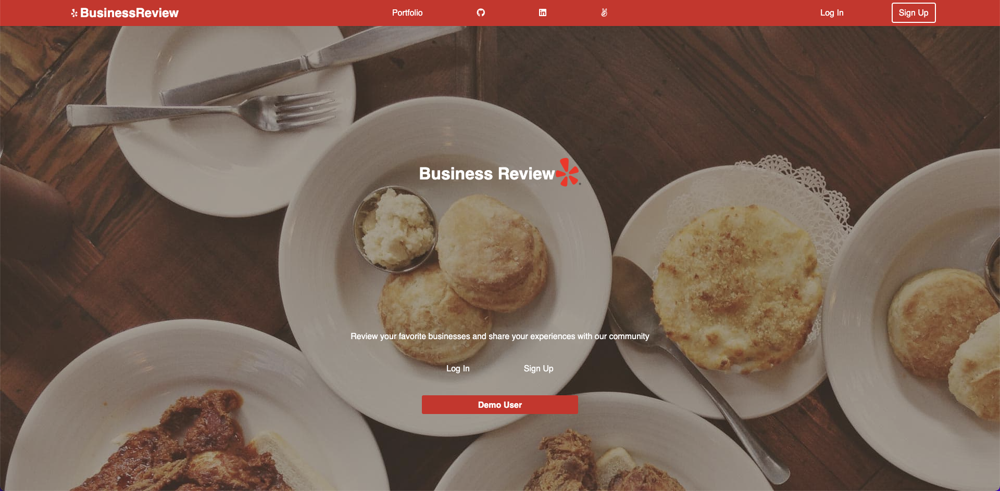
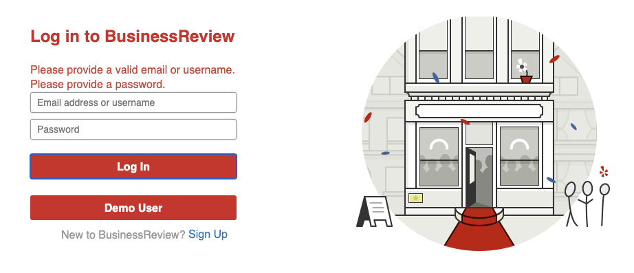
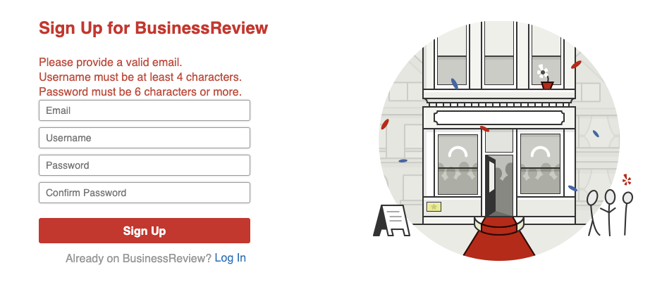
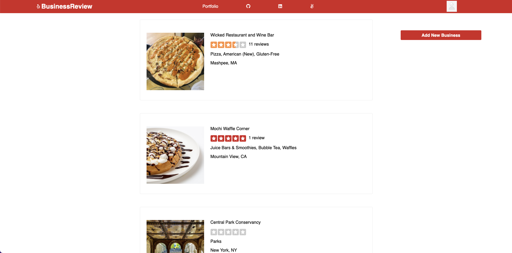
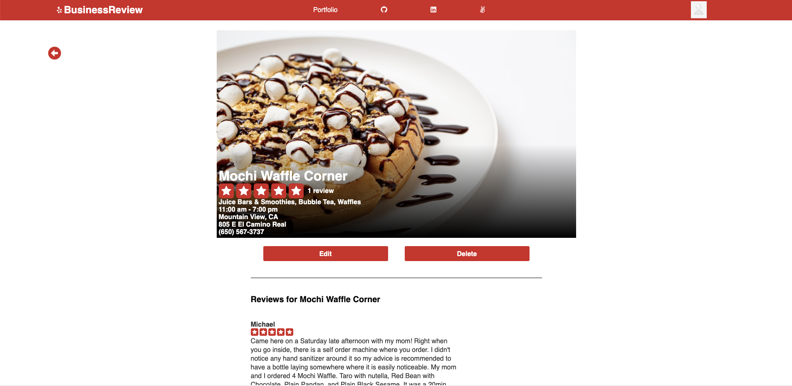
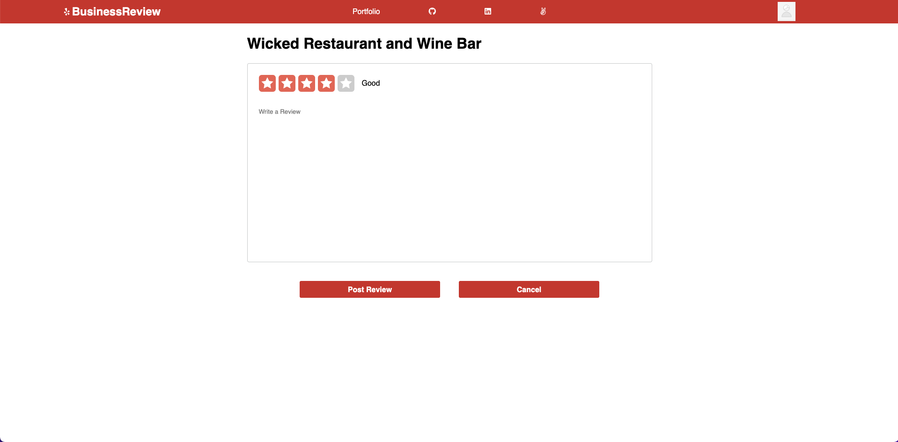

# BusinessReview
</img>
BusinessReview is a web application based on Yelp that allows people to review and rate local businesses.
***

[Visit the site live here!](https://business-review-app.herokuapp.com/)

* [Feature List](https://github.com/srvorkap/BusinessReview/wiki/Feature-List)
* [Database Schema](https://github.com/srvorkap/BusinessReview/wiki/Database-Schema)

# Technologies Used



- React
- Redux
- HTML
- CSS
- Node
- Postgres
- JavaScript
# Getting Started

1. Clone this repository

* ```https://github.com/srvorkap/BusinessReview```

2. CD into the backend directory and install dependencies

* ```npm install```

3. Create a .env file based on the .env.example with proper settings for your development environment

4. Create PostgreSQL user with following command and make sure it matches your .env file
* ```CREATE USER <username> WITH PASSWORD <'password'> CREATEDB```

5. Create database, tables and rows
* ```npx dotenv sequelize db:create```
* ```npx dotenv sequelize db:migrate```
* ```npx dotenv sequelize db:seed:all```

6. From backend directory
* ```npm start```

7. Open second terminal, cd into frontend directory and install dependencies with command
* ```npm install```

8. Run the React app
* ```npm start```

# Features

## Landing Page
New users can click on sign up button on landing page or navbar which will take them to the sign up page. Existing users can click on login button on landing page or navbar that will take them to the login page. There is also a demo button which will allow someone to quickly sign up as a demo user and explore the site.



## Login Page

There is also a demo button on login page.
Error handling login page.



## Signup Page

Error handling for signup page



## Businessess Page

Once logged in user is redirected to businesses page where he can see list of all businesses. He can click on each individul business and open individual business page.

</img>

## Business Page - that doesn't belong to the current user

Here user has an option to write a review.

</img>

## Business Page - that belongs to the current user

Here user can edit or delete business because it belongs to him but he ca't write a review.

</img>

## Write a Review

User can rate business with start rating system and leave a review.

</img>
